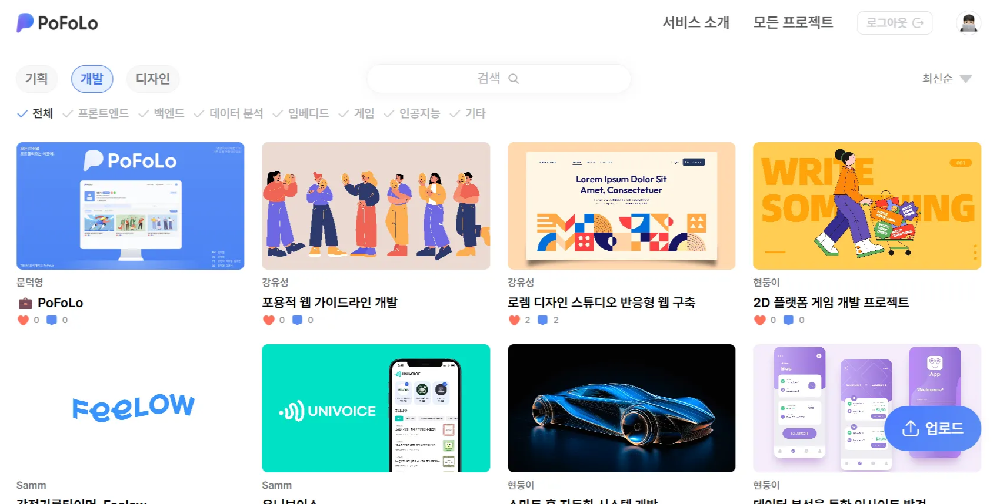
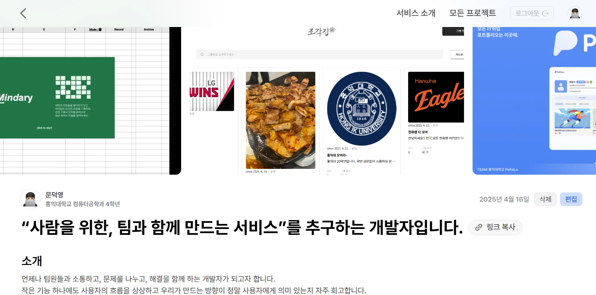
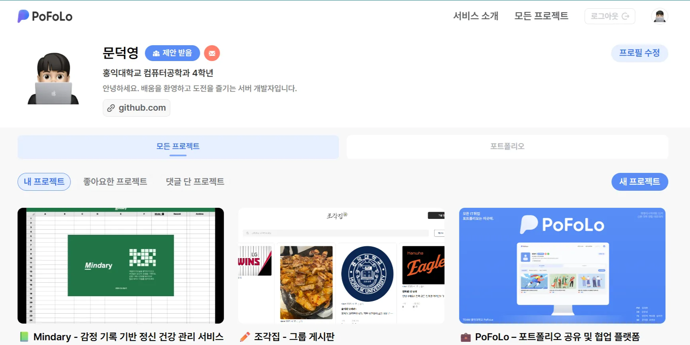
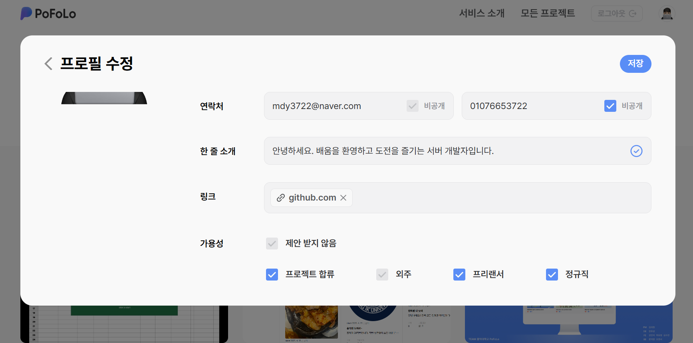
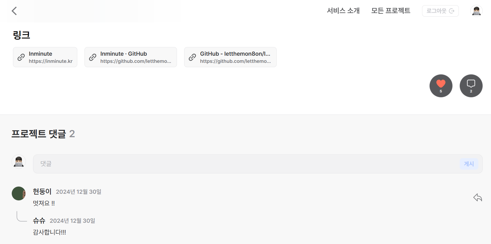
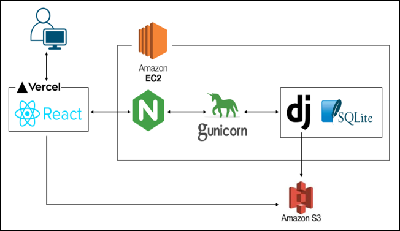
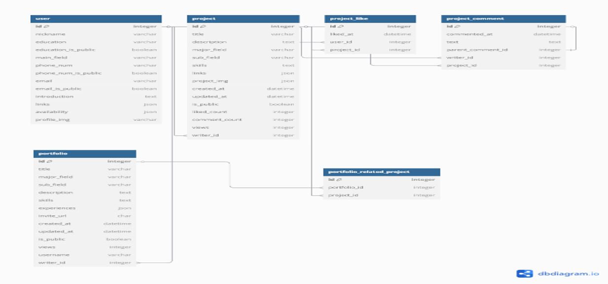
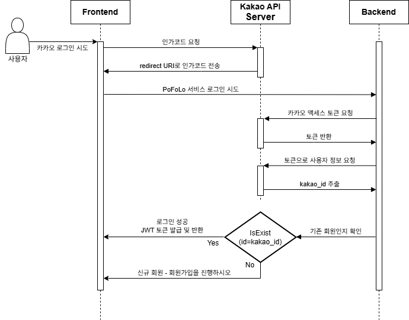

## PoFoLo - 모든 IT 포트폴리오를 한 곳에 (Backend)

> 개발자, 디자이너, 기획자 등 다양한 IT 취업 준비생들이 자신이 수행한 프로젝트를 등록하고, 포트폴리오로 묶어 협업 기회를 모색할 수 있도록 돕는 웹 기반 서비스입니다.

🔗 서비스 주소: [https://pofolo.site/](https://pofolo.site/)  
※ 현재는 서비스 운영이 중단되었습니다.

---

### 프로젝트 개요

| 항목 | 내용 |
|------|------|
| ⏰ 개발 기간 | 2024.10 ~ 2024.12 |
| 👨‍👩‍👧‍👦 참여 인원 | 총 7명 (기획 1, 디자인 1, 프론트 3, 백엔드 2) |
| 🧩 주요 기능 | 포트폴리오 생성 및 공유, 프로젝트 필터링 검색, 가용성 표시, 카카오 소셜 로그인 |

---

### 나의 역할

- **서비스 전체 흐름 및 구조 설계**
  - 시스템 아키텍처 및 ERD 설계
  - Notion 기반 API 명세서 작성

- **Django 기반 백엔드 전반 구현 (DRF 기반 REST API)**
  - 사용자 인증 / 프로젝트 CRUD / 댓글 API 구현
  - JWT 기반 인증 시스템 구성

- **Kakao OAuth2.0 로그인 설계 및 구현**
  - 카카오 인가 코드를 통해 액세스 토큰 발급 후 사용자 정보 조회
  - `kakao_id`를 기반으로 사용자 존재 여부 판단
  - 최초 로그인 시, 닉네임/가용성/이메일 등 추가 정보를 입력받아 회원가입 처리
  - 이후 JWT를 발급하여 로그인 완료

- **이미지 업로드 기능 구현**
  - 백엔드 서버에서 S3로 직접 이미지 업로드 처리
  - 게시글 및 프로필 이미지 업로드 시 S3에 저장하고, 저장된 file URL을 응답으로 반환
  - 프론트에서 이미지 조회 시, 요청에 따라 백엔드가 Presigned URL을 생성하여 전달

- **배포 및 운영 환경 구성**
  - AWS EC2 기반 서버 구성 및 도메인 등록 후 연결
  - Gunicorn + Nginx 기반 WSGI 서버 구성 및 HTTPS 인증서 적용
  - 프론트엔드(Vercel)와의 연동을 위한 리버스 프록시 및 CORS 설정

 

### 기술 스택

  
  
  
  
  
  
  
  

 

## 🖼 UI 및 아키텍처 이미지 (클릭하여 확인)

<b>📌 메인 화면 및 주요 UI</b>

<b>📌 시스템 아키텍처</b>

<b>📌 ERD</b>

<b>📌 Kakao 로그인 플로우</b>

 

## 📚 회고

> 실무에 가까운 OAuth 인증, 이미지 업로드, S3 연동, 배포 환경 구성까지 경험하며 백엔드 전반의 흐름을 주도적으로 설계하고 구현하였습니다. 단순한 기능 구현을 넘어 API 명세 작성과 협업 커뮤니케이션 등 실서비스 개발의 핵심 과정을 직접 리딩했던 경험이었습니다.

---
